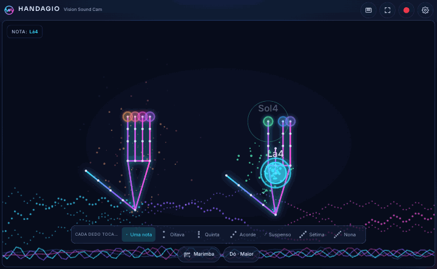

# Handagio

**Vision Sound Cam:** instrumento musical controlado pela webcam.

Um instrumento musical que se toca com as mãos à frente da webcam. Cada dedo toca uma nota ou um som de percussão; a rapidez com que dobras o dedo define a intensidade, subir ou descer a mão depois de tocar dobra o tom e abrir a boca aplica um efeito ao som.



> Tudo corre no navegador. O vídeo da câmara nunca sai do teu computador.

## Como usar

1. Abre a app e carrega em **Ligar câmara e som**. Permite o acesso à câmara.
2. Mostra as duas mãos à câmara, com os dedos esticados.
3. Dobra um dedo para tocar a nota dele. O mindinho esquerdo é a nota mais grave e o mindinho direito a mais aguda. Os polegares estão desligados por defeito (liga-os em **Escala e acordes → Usar também os polegares**).
4. Quanto mais depressa dobras, mais forte soa. Sobe ou desce a mão para mudar o tom.
5. Abre a boca para aplicar o efeito escolhido no rodapé ou na gaveta **Efeitos** (wah, filtro, distorção, eco, vibrato, robô, tremolo ou expressão).

A app aprende a tua mão enquanto tocas: vai vendo até onde cada dedo estica e dobra e ajusta-se sozinha, para o anelar e o mindinho tocarem com menos esforço (desliga em **Definições → Mãos → Aprender a minha mão enquanto toco**; **Repor calibração** esquece o que aprendeu).

Sem câmara, toca com o teclado: **A S D F** (mão esquerda) e **J K L Ç** (mão direita); **G** e **H** são os polegares. Segura **Espaço** para simular a boca aberta. O teclado de piano e os pads também se tocam com o rato ou com toque.

### Como os dedos tocam notas

Na gaveta **Escala e acordes** escolhes como cada dedo sabe que nota tocar. A fila "notas de cada dedo", no fundo da gaveta, mostra sempre o que cada dedo toca, da esquerda para a direita.

- **Escala** (por defeito): os dedos tocam as notas de uma escala, uma a seguir à outra, a subir do mindinho esquerdo para o mindinho direito.
  - A **escala** é a lista de notas que se podem tocar. Por defeito é **Dó Maior** (dó-ré-mi-fá-sol-lá-si). Na Pentatónica (5 notas por oitava, sem Fá nem Si em Dó) qualquer combinação soa bem.
  - A **tónica** é a nota de partida da escala (a "casa"). **Tónica no** escolhe que dedo a toca: o **mindinho esquerdo** (por defeito: as notas só sobem, do mindinho esquerdo ao direito) ou o **indicador direito** (as notas descem para a esquerda e sobem para a direita).
  - Por defeito (Dó Maior, tónica no mindinho esquerdo), os 8 dedos tocam `Dó4 Ré4 Mi4 Fá4 | Sol4 Lá4 Si4 Dó5` (mão esquerda | mão direita), do mindinho esquerdo ao mindinho direito.
  - Exemplo, Dó Pentatónica com a tónica no indicador direito: `Ré3 Mi3 Sol3 Lá3 | Dó4 Ré4 Mi4 Sol4`. Com a tónica no mindinho esquerdo: `Dó4 Ré4 Mi4 Sol4 | Lá4 Dó5 Ré5 Mi5`.
  - A mão esquerda e a direita reconhecem-se pela forma da mão, não pelo lado do ecrã: com uma só mão à vista, o mindinho esquerdo continua a tocar a nota do mindinho esquerdo.
  - A **oitava base** (nas definições) sobe ou desce tudo.
- **Altura da mão e arrastar** (nas definições, secção Tocar), duas opções independentes:
  - **A altura da mão escolhe a nota** (desligada por defeito, só no modo Escala): a altura do pulso quando dobras o dedo sobe ou desce a nota pela escala, cerca de um grau por cada 10% do ecrã acima ou abaixo do meio.
  - **Arrastar a nota depois de tocar** (ligada por defeito): com o dedo dobrado, sobe ou desce a mão para dobrar o tom a partir da nota que tocaste, cerca de 2 meios-tons por cada 10% do ecrã, até uma oitava para cada lado. Um tremor pequeno não conta. Só se ouve nos instrumentos de nota longa (violino, flauta, órgão, sopros…), e funciona também no modo Personalizado.
- **Personalizado**: escolhes a nota exata de cada dedo. Toca num dedo da fila, escolhe a nota (Dó a Si) e a oitava, e ouves logo como soa; Por defeito, as notas são as mesmas do modo Escala por defeito (`Dó4 … Dó5`); **Copiar da escala** começa pelas notas que o modo Escala está a tocar. Aqui a altura da mão não escolhe a nota (arrastar depois de tocar continua a funcionar), e os acordes são sempre maiores (Acorde: a nota e as que ficam 4 e 7 meios-tons acima).
- **Polegares**: com **Usar também os polegares**, tocam 10 dedos em vez de 8. O polegar mexe-se sem querer quando dobras os outros dedos, por isso só toca se ficar bem dobrado durante um instante; se tocar sem querer ou custar a tocar, ajusta **Sensibilidade dos polegares** nas definições (secção Mãos).

### Interface

O palco da câmara ocupa todo o espaço livre, com margens mínimas e seja qual for a proporção da câmara (também num tablet em paisagem); por cima fica uma barra de controlo fina com o instrumento, a escala, o tempo, gravar, o looper e um menu **⋯** com o resto. Por baixo do palco, um rodapé com todos os efeitos identificados: Reverb, Eco, Filtro, Drive e Pitch em knobs pequenos, com o nome por baixo (o valor aparece ao passar o rato ou com o foco), e o efeito da boca com o seu medidor. No telemóvel e em janelas com menos de 600 px de altura o rodapé esconde-se e os efeitos ficam na gaveta Efeitos, pelo menu ⋯. O que não cabe na barra fica em gavetas (Instrumentos, Escala e acordes, Efeitos, Tempo e looper, Gravações, Tocar com o rato), abertas uma de cada vez. O palco mostra só as tuas mãos e as partículas (tu não apareces, nem na gravação: a câmara serve só para a deteção) e, por baixo, uma faixa com as ondas do som.

- **Cada dedo toca…** (coluna à esquerda do palco, tecla `C` ou menu ⋯ no telemóvel), da mais simples à mais rica:
  - **Uma nota**: a melodia;
  - **Oitava**: a nota e a mesma uma oitava acima;
  - **Quinta**: nota, quinta e oitava (o "power chord");
  - **Acorde**: 3 notas da escala, maior ou menor conforme o dedo;
  - **Suspenso**: aberto, sem maior nem menor (sus4);
  - **Sétima**: 4 notas, com a 7.ª;
  - **Nona**: 5 notas, com a 7.ª e a 9.ª.

  Cada opção tem um desenho com um ponto por nota; a explicação aparece ao passar o rato ou por um instante depois de tocar. Em ecrãs baixos a coluna mostra só os desenhos, em duas colunas.
- **⛶ Ecrã inteiro** (tecla `E`) e **esconder a interface** (tecla `I`, ou no menu ⋯): fica só o palco. Mexer o rato ou tocar no ecrã volta a mostrar a barra por 3 segundos.
- **`,` e `.`** passam ao instrumento anterior ou seguinte sem abrir a gaveta.

### Funcionalidades

- 38 instrumentos: 35 melódicos (teclas, cordas, sopros, lâminas e sintetizadores, incluindo o theremin contínuo) e 3 kits de percussão (acústico, 808 e latino). Os 18 acústicos (piano, órgão, cordas, sopros, harpa, guitarras e xilofone) tocam gravações reais, cada um no seu registo.
- 11 escalas, tónica de Dó a Si e oitava base de 1 a 6.
- Reverb, eco, pitch, filtro e drive em knobs rotativos (arrastar na vertical, roda do rato, setas, duplo clique para repor).
- Metrónomo de 60 a 180 BPM com tap tempo, quantização a 1/8 ou 1/16 e looper de 1, 2 ou 4 compassos com camadas, desfazer e "congelar" no instrumento gravado.
- **GRAVAR** grava o áudio (webm/opus, ou mp4 no Safari) e, se quiseres, também o vídeo com os efeitos visuais. As gravações ficam guardadas no navegador e podem ser ouvidas, descarregadas, partilhadas ou apagadas.
- Predefinições de fábrica ("Piano calmo", "Batida 808", "Theremin espacial", "Coro etéreo") e as tuas, guardadas pelo nome.
- **Calibrar mãos** (nas definições): estica os dedos durante 3 s e depois dobra-os durante 3 s para ajustar os limiares à tua mão.
- Tema escuro e tema claro, respeito por `prefers-reduced-motion`, funciona com teclado e leitores de ecrã.
- Instala-se como app (PWA) e funciona sem internet depois do primeiro carregamento.

Se a deteção das mãos não carregar, a app passa ao **modo movimento**: o ecrã divide-se em colunas, uma por dedo, e toca-se mexendo a mão numa coluna.

## Desenvolvimento

Requer Node 20 ou mais recente.

```bash
npm install
npm run dev          # descarrega os modelos (1.ª vez) e abre em http://localhost:5173
```

| Comando | O que faz |
| --- | --- |
| `npm run dev` | Servidor de desenvolvimento |
| `npm run build` | Verificação de tipos e build de produção para `dist/` |
| `npm run preview` | Serve o build de produção |
| `npm run lint` | ESLint (zero avisos) |
| `npm test` | Testes unitários (Vitest) |
| `npm run test:e2e` | Teste end-to-end com câmara falsa (Playwright); na 1.ª vez corre `npx playwright install chromium` |
| `npm run fetch-models` | Copia o WASM e descarrega os modelos do MediaPipe para `public/mediapipe/` |
| `npm run prepare-samples` | Prepara as amostras dos instrumentos gravados em `public/samples/` (à mão, precisa de rede) |

O GIF de demonstração gera-se com `node scripts/make-demo-gif.mjs` (com `npm run dev` a correr).

### Acrescentar um instrumento gravado

1. Em `scripts/prepare-samples.mjs`, acrescenta uma linha à tabela `INSTRUMENTS`, por esta ordem: o id, a pasta da biblioteca [tonejs-instruments](https://github.com/nbrosowsky/tonejs-instruments), o tipo (`sustained`, `plucked` ou `struck`), a duração máxima em segundos, a nota mais grave, a nota mais aguda e a origem das gravações (para os créditos).
2. Corre `npm run prepare-samples`. O script descarrega as notas, converte-as para mono, corta-as, normaliza-as a −20 dBFS e grava MP3 a 96 kbps (ou 80, para caber em 250 KiB por instrumento e 4 MiB no total) em `public/samples/<id>/`, e atualiza `public/samples/manifest.json` e `public/samples/CREDITS.md`.
3. Acrescenta a entrada em `src/audio/samples/catalog.ts`: nome, família, tipo (`sustained`, `plucked` ou `struck`), registo em oitavas, `rel`, o patch sintetizado de reserva e o `level` em dB, medido para soar ao nível da reserva.
4. `npm test` confirma que o catálogo e o manifest batem certo.

As amostras só são descarregadas quando o instrumento é escolhido; enquanto chegam, toca o patch de reserva.

### Estrutura

```
src/
  app/      App, barra de topo, sessão (câmara → visão → gestos → áudio) e gravação
  state/    store Zustand (preferências persistidas), store transitório a 60 fps, presets, IndexedDB
  vision/   câmara, HandLandmarker, FaceLandmarker, dobra dos dedos, gestos, modo movimento, calibração
  audio/    motor Web Audio, patches, kits, efeitos, teoria, metrónomo, looper, gravação, analisador
  ui/       palco (overlay, HUD, partículas), barra e gavetas (shell/), painéis, teclado, pads, controlos, ícones
docs/       DECISIONS.md, ARCHITECTURE.md
```

`src/vision` e `src/audio` não dependem do React. Mais detalhes em [docs/ARCHITECTURE.md](docs/ARCHITECTURE.md) e as decisões tomadas em [docs/DECISIONS.md](docs/DECISIONS.md).

### Publicar

O build é estático e usa caminhos relativos, por isso funciona em Vercel, Netlify ou GitHub Pages (incluindo numa subpasta). O `prebuild` descarrega os modelos, por isso o ambiente de build precisa de acesso à internet na primeira vez. A câmara só funciona em `https` ou em `localhost`.

## Navegadores

Testado em Chromium (desktop, com GPU). Nos outros navegadores:

- **Edge**: igual ao Chrome.
- **Firefox**: deve funcionar; a deteção pode cair para CPU e ser mais lenta. A Web Share API com ficheiros não existe no Firefox desktop, por isso "Partilhar" descarrega o ficheiro.
- **Safari** (macOS e iOS 16.4+): as gravações saem em mp4 (`audio/mp4`, `video/mp4`) e a partilha usa a folha de partilha do sistema. No iOS o som só arranca depois de tocar no ecrã e o interruptor de silêncio do iPhone pode cortar o áudio da página. O delegate GPU do MediaPipe pode falhar em alguns iPhones; nesse caso a app usa CPU automaticamente.

## Créditos

Deteção de mãos e face com [MediaPipe Tasks Vision](https://ai.google.dev/edge/mediapipe/solutions/vision/hand_landmarker). Os restantes sons são sintetizados com a Web Audio API.

### Créditos dos sons

As gravações dos instrumentos acústicos vêm da biblioteca [tonejs-instruments](https://github.com/nbrosowsky/tonejs-instruments), de Nicholas Brosowsky, com as amostras sob [CC-BY 3.0](https://creativecommons.org/licenses/by/3.0/). Origem das gravações:

- [VSCO 2 Community Edition](https://vis.versilstudios.net/vsco-community.html) (CC0): piano, órgão, violino, contrabaixo, flauta, clarinete, fagote, trompete, trompa, trombone, tuba, harpa e xilofone;
- [Karoryfer Samples](https://www.karoryfer.com/karoryfer-samples) (CC0): baixo elétrico, saxofone e guitarra elétrica;
- [University of Iowa Musical Instrument Samples](https://theremin.music.uiowa.edu/MIS.html) (sem restrições): guitarra acústica;
- Freesound, pack ["Real Cello Notes"](https://freesound.org/people/flcellogrl/packs/12408/) de flcellogrl: violoncelo (CC-BY 3.0 no pack; a página do Freesound mostra hoje CC BY 4.0).

As amostras foram cortadas, convertidas para mono e comprimidas. A lista completa está em [`public/samples/CREDITS.md`](public/samples/CREDITS.md).
